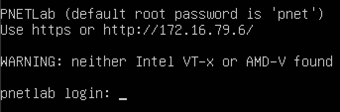

# PNET

## Documentation PNET LAB

### 1. Konfigurasi 
Sebelum memulai, download file `pnet.ova`terlebih dahulu. untuk link download ada dibawah :

[Download](https://pnetlab.com/pages/download){ .md-button .md-button--primary }

Jika sudah download, masukan file ke vmware kalian. Lalu setting pnet lab sesuai kemampuan laptop kalian, apabila ram laptop 16 GB maka pilih 2 processors, tetapi apabila ram laptop 8 GB maka pilih 4 processors.

Apabila sudah di setting semua, maka tampilan akan seperti ini :

Masukan username `root` dan paswwordnya yang kalian buat di awal tadi, dan jika sudah maka tampilan akan seperti ini :

dan ip yang ada di tampilan tersebut di masukan ke chrome dan tampilannya akan muncul tulisan online mode dan offline mode, kalian pilih yang offline mode. setelah klik maka tampilannya akan seperi ini :

Apabila kalian baru pertama kali, maka tampilannya seperti membuat akun pada umumnya, kalian harus membuat username dan passwordnya, kalau sudah membuat akunnya maka tampilan ketika masuk akan seperti ini :

### 2. Setting interfaces

### 3. Setting ishare2

Apabila sudah melakukan langkah diatas, langkah selanjutnya adalah install ishare2, yaitu pertama kalian klik link dibawah ini :

[CLICK](https://github.com/pnetlabrepo/ishare2){ .md-button .md-button--primary }

lalu scroll kebawah sampai kalian menemukan tulisan `installation` dan salin salah satu dari `wget` atau `curl`

Tempelkan ke terminal pnet lab kalian, dan tampilannya akan seperi ini :

### 4. Fix permission 

### 5. Add router os